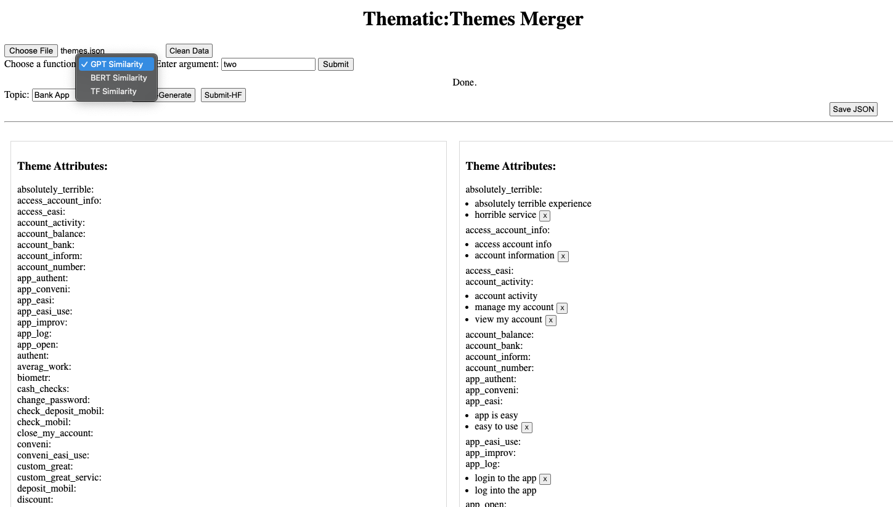

# Flask Thematic Theme Merger

## Description
This Flask application is designed to merge thematic data using various similarity algorithms like BERT, GPT, and Term Frequency (TF). It allows users to upload JSON data, process it through different similarity measures, and save the merged results with Human feedback label.  
The application also supports generating new data based on GPT-4 models and incorporates functionality for saving human feedback.



## Installation

### Prerequisites
- Python 3.11
- Flask
- Additional Python libraries: requirements.txt
- Browser: Google Chrome

### Setup
1. Clone the repository:
   ```bash
   git clone [repository URL]
   ```
2. Navigate to the project directory:
   ```bash
   cd [project directory]
   ```
3. Install the required dependencies:
   ```bash
   pip install -r requirements.txt
   ```

## Usage

### Running the Application
1. Start the Flask server:
   ```bash
   python app.py
   ```
2. Open a web browser and navigate to `http://localhost:5000/`.

## Test: 13 test cases
- **test/test_app.py : 6 cases ---
- **test/sentence_similarity.py : 6 cases --- 
- **test/evaluation.py : 1 case 


   ```bash
   pytest
   ```

### Features
- **Data Upload**: Users can upload JSON data for processing.
- **Data Processing**: Choose between BERT, GPT, or TF algorithms to merge thematic data.
- **Generate Data**: Leverage GPT-4 to generate new thematic data based on user input.
- **Save Results**: Save the merged themes and human feedback in JSON format.
- (After labeling 20-30 sets of ground truth data, we can let GPT-4 generates training data based on these ground truth seeds.)

## Contributing
Contributions to this project are welcome. Please follow these steps:
1. Fork the repository.
2. Create a new branch (`git checkout -b feature_branch`).
3. Make your changes and commit them (`git commit -am 'Add some feature'`).
4. Push to the branch (`git push origin feature_branch`).
5. Create a new Pull Request.

## Code of Conduct
Please note that this project is released with a Contributor Code of Conduct. By participating in this project you agree to abide by its terms.

## License
This project is licensed under the [LICENSE NAME] License - see the [LICENSE.md](a link to your license file) file for details.

## Acknowledgments

- Inspiration by Thematic.
- etc.
.
